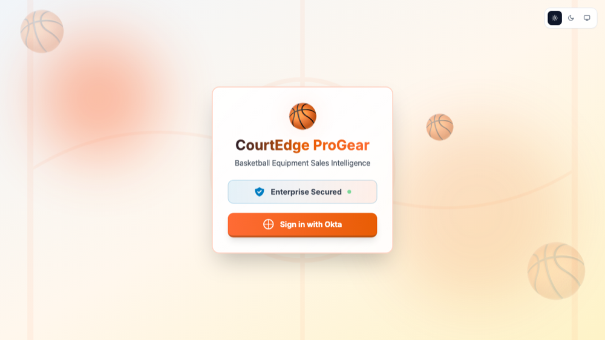

# ProGear Sales AI: Okta AI Agent Governance + FGA Demo

> **AI agents are identities. Every delegated action stays attributable.** CourtEdge ProGear registers its customer-owned sales agent in Okta as a [Workload Principal](https://developer.okta.com/docs/api/secures-ai/ai-agents)—a first-class identity with its own owners, credentials, lifecycle, resource connections, and audit trail. When the agent acts for Sarah, Mike, or Joe, **Cross App Access (XAA)** uses the [IETF Identity Assertion JWT Authorization Grant (ID-JAG)](https://datatracker.ietf.org/doc/html/draft-ietf-oauth-identity-assertion-authz-grant) to carry the user's identity across trust domains while identifying the agent client acting on that user's behalf. The result is a traceable delegation chain: **user → agent → resource → scope → action**. [Explore XAA.dev](https://xaa.dev/).

Before any delegation, ProGear reads the employee's live Okta profile. An **On vacation** value of `true` suspends agent work before ID-JAG, while the synchronized **Manager** value makes the employee's role easy to understand and audit. **FGA** then evaluates the signed clearance level and requested quantity. [**Okta Identity Governance**](https://developer.okta.com/docs/api/iga) is used for one deliberate escalation: a Manager requesting more than 600 units needs VP approval.


## Live Demo

**Production app:** [progear-sales-aiagent.vercel.app](https://progear-sales-aiagent.vercel.app)

Production deploys from `main`; feature branches may produce temporary previews, but they are not production sources.

### How Okta governs this custom agent

The ProGear Sales Agent is not a generic chatbot identity or a separate identity for each internal tool. Its Workload Principal (`wlp`) under **Directory → AI Agents** is the durable control point for the complete agent: administrators can assign owners, manage credentials and resource connections, activate or deactivate it, and use Okta's System Log to trace its delegation activity. The application remains customer-owned; Okta supplies the governed identity and preserves accountability when that agent acts for a user.

User sign-in uses a dedicated Okta OIDC web app linked to the registered ProGear Sales Agent. In the compatibility model active in this tenant, the sign-in client has its own `0oa...` ID while the governed agent keeps its separate `wlp...` identity. Both use independent `private_key_jwt` credentials; there is no shared client secret. See [Okta AI Agent Client Binding Compatibility](docs/agent-client-binding-compatibility.md).

[](https://progear-sales-aiagent.vercel.app/auth/signin)

*The application owns this sign-in experience and delegates authentication to Okta. No application password is collected by ProGear.*

Pages in the running app:

| Route | What it shows |
|---|---|
| `/` | The chat UI ("CourtEdge ProGear"), talk to the sales assistant |
| `/tokens` | The signed token chain, independent resource-token validation, final business decision, and pending approval status |
| `/architecture` | Identity-centered architecture and sequence diagrams for Workload Principal governance, ID-JAG delegation, scoped access, auditability, and the agent deactivation control; the advanced FGA layer appears only when its simulation is enabled |
| `/fga` | Opt-in FGA demo with the fixed live Okta role, a browser-session-isolated vacation control, and a simple D3 decision view |

The application starts with **Simulate FGA** off and shows two everyday prompts: an inventory read and a normal 50-unit write. In this coarse mode, Sarah is read-only, while a validated `inventory:write` token lets Mike or Joe execute any positive quantity. Enabling the simulation on `/fga` displays the signed-in employee's fixed Okta role and derived Manager value, exposes the On vacation control, replaces those examples with the Read, 1–600, and 601+ VP prompt tiers, and opts chat requests into hosted FGA checks plus OIG approval routing. Sarah always remains Sales, Mike always remains Manager, and Joe always remains VP. Only the vacation demonstration is an authenticated server-side overlay isolated to the current browser tab; it never changes the shared Okta profile. The tab stores a random session ID in `sessionStorage`; refreshes and sign-outs keep that tab's FGA choice, while closing the tab ends the browser session and a fresh tab starts with FGA off. FGA adds the quantity boundary; it never grants a scope Okta denied. Color preferences are independent: Light is the first-visit default, with Dark and System available from the persistent theme control.

### Demo personas at a glance

With **Simulate FGA** enabled, the three default Okta role levels tell one complete inventory story:

| Persona | Okta role level | Manager | Inventory behavior |
|---|---:|---|---|
| Sarah Sales | 0 — Sales | False | Reads directly; every inventory write stops before ID-JAG exchange, with guidance to contact her manager. No access request is created. |
| Mike Manager | 1 — Manager | True | Reads and writes 1–600 units directly; writes of 601+ units request VP approval when FGA is enabled. |
| Joe VP | 2 — VP | True | Reads and writes any quantity directly. |

Sarah, Mike, and Joe are example personas, not hard-coded identities. The backend resolves the authenticated employee's current Okta profile by subject on every request, so any user assigned `clearance_level` 0, 1, or 2 follows the same Sales, Manager, or VP policy. `is_a_manager` is synchronized from that level (`false`, `true`, `true`) rather than acting as a second role switch. `is_on_vacation` is separate: all three personas default to `false`, and setting it to `true` stops the agent before ID-JAG for every protected resource and every action. Use your Okta identity-lifecycle or profile-mapping process to assign and maintain these values when onboarding additional users.

The hosted app uses **ProGear Inventory MCP** for coarse Inventory access: `ProGear-Sales` receives only `inventory:read`, while `ProGear-Managers` and `ProGear-VPs` receive `inventory:read` and `inventory:write`. The separate **MCP Bridge - ProGear Inventory Write MCP** authorization server protects the Bridge's write capability and has Manager and VP write rules only. FGA is not a separate authorization server; when enabled, it evaluates role plus quantity after the coarse Okta gate.

For the approval demo, assign the **Okta Access Requests** app to the Manager and VP groups, push `ProGear-VPs` into Access Requests, and assign the request type's approval task to that pushed group. The backend sends Mike's Okta user ID in `requesterUserIds`, so OIG shows the signed-in Manager as the requester and the service credential owner separately as the request creator. Joe opens **Okta Access Requests → Inbox → Open** to approve or deny the task. The approval card contains only a concise human summary; the exact machine-readable execution intent stays in the backend approval ledger.

## What This Demo Shows

An AI sales agent needs to read and write real business data (inventory, pricing, customer records) on a user's behalf. This demo answers the questions that matter for enterprise AI agent security:

- **WHO** requested this access, and **WHAT** agent acted on their behalf?
- **WHICH** scopes were actually granted, per resource domain, per user?
- **CAN** a second decision (clearance level + quantity) still block or route an otherwise-authenticated action?
- **WHEN** does a human need to approve before an action executes?
- **SHOULD** the agent be allowed to act for this employee right now, or should vacation status suspend delegation first?
- **CAN** access be revoked instantly?

| Layer | Technology | What it does |
|---|---|---|
| Identity for the agent | Okta AI Agent Governance | The AI has its own Workload Principal (`wlp`) identity, distinct from any human user |
| Token exchange | ID-JAG (Identity Assertion JWT Authorization Grant) | Two-step exchange: ID token → ID-JAG assertion (Org Authorization Server) → scoped access token (per-domain Custom Authorization Server). RSA keypair auth, no shared secret. No down-scoping: an ungrantable scope fails the whole exchange. |
| Delegation context | Okta user profile | `is_on_vacation=true` stops before ID-JAG; `is_a_manager` remains synchronized with the authoritative role level |
| Fine-grained authorization | FGA | Maps Okta's role level (0 Sales, 1 Manager, 2 VP) and requested quantity to allow, block, or VP approval |
| Human-in-the-loop | Okta Identity Governance (OIG) | A Manager write of 601+ units routes to VP approval; Sales writes never create requests |
| Orchestration | LangGraph | Routes each user query to the right internal domain component and coordinates the response |
| LLM calls | Anthropic Claude, via the raw Anthropic SDK | Internal domain components call Claude directly (not through LangChain's LLM wrapper) for routing and response generation |

For the role matrix and live configuration, see **[docs/inventory-role-levels.md](docs/inventory-role-levels.md)**. For the broader technical walkthrough, see **[docs/architecture.md](docs/architecture.md)**.

## One governed agent, four resource domains

Okta governs one **ProGear Sales Agent** workload identity. The application contains four internal domain components, and each resource domain has its own Custom Authorization Server and scope boundary. A user's group membership determines which scopes the single agent can obtain for that user in each domain.

| Resource domain | Scopes |
|---|---|
| Sales | `sales:read`, `sales:quote`, `sales:order` |
| Inventory | `inventory:read`, `inventory:write` |
| Customer | `customer:read`, `customer:lookup`, `customer:history` |
| Pricing | `pricing:read`, `pricing:margin`, `pricing:discount` |

## Demo Data

90 inventory SKUs across 8 categories (Basketballs, Hoops & Backboards, Nets & Accessories, Uniforms & Apparel, Training Equipment, Footwear, Court & Game Equipment, Bags & Storage) and 34 customers, defined in `backend/data/initial_data.json` and served through `backend/data/demo_store.py`. On boot, the backend regenerates a runtime snapshot at `backend/data/live_data.json` (gitignored: it's derived state, never commit it and never hand-edit it).

## Tech Stack

| Area | Stack |
|---|---|
| Frontend | Next.js 14 (App Router), TypeScript, Tailwind CSS, NextAuth.js (Okta OIDC), D3.js (architecture visualizations) |
| Backend | Python, FastAPI (`backend/api/main.py`) |
| Orchestration | LangGraph (`langgraph>=0.2.0`, a real dependency, not just a label), `backend/orchestrator/orchestrator.py` |
| LLM integration | Anthropic Python SDK, called directly by internal domain components (no LangChain LLM wrapper) |
| AuthN/AuthZ | Okta AI Agent Governance (ID-JAG), FGA (`openfga-sdk`), Okta Identity Governance |
| Deployment | Vercel (frontend), Render (backend) |

### A known, honest limitation

There's a separately deployable MCP sample in this repo (`packages/progear-sales-mcp-server`). **It is not currently in the live request path and is not production-hardened.** Its explicit local-demo bypasses must be removed before it protects real data. The live backend's in-process resource boundary fails closed and independently validates every Okta token's signature, issuer, audience, expiry, agent identity, delegated user, and required scope before data access. Inventory writes additionally require the final simple/FGA decision to be `allow`; the old simulated-success fallback has been removed.

## Quickstart

This repo is an npm workspaces monorepo (`packages/progear-sales-agent`, `packages/progear-sales-mcp-server`) plus a standalone Python `backend/`.

```bash
# Frontend
npm install
npm run dev --workspace=packages/progear-sales-agent

# Backend
cd backend
pip install -r requirements.txt
uvicorn api.main:app --reload
```

Copy `.env.example` to `.env` and fill in real values before running anything. It lists the primary frontend, backend, and MCP sample settings, plus comments for advanced optional overrides.

For a full walkthrough of Okta org setup (AI Agent, Custom Authorization Servers, groups), FGA store setup, and deploying to Vercel + Render, see **[docs/implementation-guide.md](docs/implementation-guide.md)** (it also covers recovering from an accidentally deleted AI Agent).

> **Client-to-agent binding compatibility:** This repository currently implements the delegation-link flow that works during Okta's temporary rollback of the newer binding model. The newer model is expected to return. Before changing the binding flow, read **[docs/agent-client-binding-compatibility.md](docs/agent-client-binding-compatibility.md)**. It records the rationale, stable restore points, migration boundary, and verification checklist so the work can be resumed from GitHub in a new session.

## Customer Learning Notebook

<a href="https://colab.research.google.com/github/oktaforai-okta/ProGearSalesAI/blob/main/notebooks/progear-inventory-authorization-story.ipynb"></a>

**[Wire your custom AI agent to Okta](notebooks/progear-inventory-authorization-story.ipynb)** helps builders apply the ProGear pattern to an agent of their own. Five configuration cards walk through the one-time Okta setup—OIDC sign-in, custom-agent registration, one Custom Authorization Server, one least-privilege scope and policy, and one resource connection—with direct links to the supporting Okta documentation. The runnable half then follows user ID token → agent proof → ID-JAG → scoped resource token → protected API. A credential-free preview is included; Live Okta mode keeps private values in Colab Secrets. FGA and OIG remain optional extensions in the web application.

## Documentation

| Document | Audience | Description |
|---|---|---|
| **[docs/architecture.md](docs/architecture.md)** | Anyone who wants to understand how it works | Full system walkthrough: token exchange sequence, FGA model, approval flow, MCP notes |
| **[docs/implementation-guide.md](docs/implementation-guide.md)** | Developers, DevOps | Complete deployment walkthrough: Okta configuration, Vercel + Render setup, and recovering from an accidentally deleted AI Agent |
| **[docs/agent-client-binding-compatibility.md](docs/agent-client-binding-compatibility.md)** | Maintainers, architects | Why the current delegation-link compatibility path exists and how to migrate when Okta restores the newer client-to-agent binding model |
| **[docs/okta-security-value.md](docs/okta-security-value.md)** | Security teams, architects | The broader security framing and scenario catalog this demo draws on, including the *why* behind each design decision (why 4 auth servers, why FGA as a second layer, why human approval) |
| **[docs/okta-ai-security-essentials.md](docs/okta-ai-security-essentials.md)** | Marketers, executives, non-technical readers | The same value story as above, in plain English, no JWT/scope/issuer jargon |
| **[/architecture](https://progear-sales-aiagent.vercel.app/architecture)** (live) | Everyone | Interactive D3.js diagrams of the token exchange and access-control flows |

## Project Structure

```
ProGearSalesAI/
├── backend/
│   ├── api/main.py                 # FastAPI app and endpoints
│   ├── agents/                     # Internal Sales, Inventory, Customer, Pricing components
│   ├── auth/
│   │   ├── agent_config.py         # Per-domain auth server, scope, and optional identity overrides
│   │   ├── multi_agent_auth.py     # ID-JAG token exchange
│   │   ├── fga_client.py           # FGA checks (clearance + quantity)
│   │   └── resource_token.py       # Resource JWT validation before data access
│   ├── orchestrator/
│   │   └── orchestrator.py         # LangGraph workflow + direct Anthropic SDK calls
│   ├── services/                   # OIG approval client and other services
│   └── data/                       # demo_store.py, initial_data.json (seed data)
├── packages/
│   ├── progear-sales-agent/        # Next.js frontend (chat, /tokens, /architecture)
│   └── progear-sales-mcp-server/   # Standalone MCP sample (not in the live path; harden before production)
├── docs/                           # architecture.md, implementation-guide.md, etc.
├── notebooks/                      # Layered customer Colab integration guide
├── examples/                       # Platform-neutral token exchange reference
├── .env.example                    # Environment variable template (names only, no real secrets)
└── README.md                       # This file
```

## License

MIT (see `package.json`).
