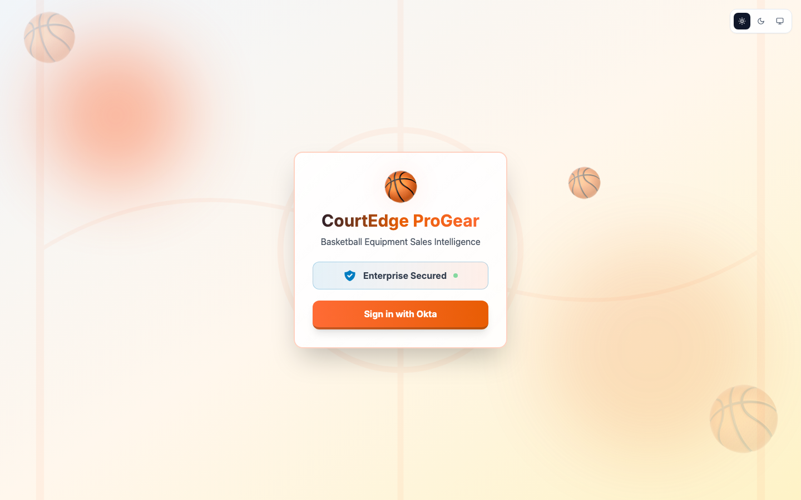

# CourtEdge ProGear — Team Demo Guide

**Demo URL:** https://progear-sales-aiagent.vercel.app  
**FGA video:** _Paste the Google Drive link here_  
**Audience:** Customer-facing teams, presenters, and technical evaluators

> Use the team-provided demo password. Do not place passwords in this guide, recordings, or customer-facing material.

## The story in one minute

| Persona | Okta role | Manager | What to demonstrate |
|---|---:|---:|---|
| Sarah Sales | 0 — Sales | False | Reads inventory. Every inventory write is denied with manager guidance. |
| Mike Manager | 1 — Manager | True | Writes 1–600 units. A 601+ write needs a VP. |
| Joe VP | 2 — VP | True | Approves Mike's 601+ request and may write any quantity directly. |

`On vacation` is separate from role. When it is True, the agent cannot act for that employee and stops before ID-JAG for every protected resource.

## Quick run of show

| Step | Presenter action | Expected result |
|---:|---|---|
| 1 | Open ProGear and sign in as Sarah. | Simple mode opens; FGA is off. |
| 2 | Ask: **How many basketballs are in stock?** | The read succeeds. |
| 3 | Ask: **Can you add 50 basketballs to the inventory?** | No change. Sarah is told to contact her manager. |
| 4 | Sign out, then sign in as Mike. | The next session again starts with FGA off. |
| 5 | Ask: **Can you add 50 basketballs to the inventory?** | The write executes because Mike is a Manager. |
| 6 | Ask: **Can you add 601 basketballs to the inventory?** | In simple mode, no change. Mike is told a VP is required. |
| 7 | Open **Architecture** and explain the topology. | Show the user, Workload Principal, Okta, Resource AS, resource, audit, and kill switch. |
| 8 | Explain the **Request sequence**. | Walk through ID-JAG and the scoped resource token. |
| 9 | Optional: open **FGA**, select **Simulate FGA**, and repeat the 601+ prompt. | FGA routes Mike's request to VP approval in OIG. |
| 10 | Joe approves in Okta Access Requests. | The backend verifies Joe's live VP role and executes once. |

> Inventory counts may change between demo runs. Focus on whether the action is read, executed, denied, or routed for approval—not on matching the screenshot's exact count.

## 1. Sign in

1. Open the demo URL.
2. Select **Sign in with Okta**.
3. Enter the selected persona's email and the team-provided demo password.
4. Start with the **Light** theme for the clearest screen recording.

**Say:** “This is a custom AI agent secured by Okta. The employee signs in, while the ProGear agent also has its own governed Workload Principal identity.”

## 2. Sarah reads inventory

1. Sign in as **sarah.sales@atko.email**.
2. Confirm the header shows Sarah.
3. Select **How many basketballs are in stock?**

**Expected:** Inventory data is returned.

**Say:** “Sarah is Sales. She can use the agent to read inventory.”

## 3. Sarah tries to write

1. Select **Go to Home** to clear the conversation.
2. Select **Can you add 50 basketballs to the inventory?**

**Expected:** Inventory does not change. Sarah is told to contact her manager.

| What happened | Why |
|---|---|
| Sarah authenticated successfully. | Authentication proves who Sarah is; it does not grant every action. |
| Her live Okta role is Sales, level 0. | Sales is read-only for Inventory. |
| The write stops before delegated token exchange. | A known-ineligible write should not receive an ID-JAG or reach Inventory. |
| No approval request is created. | Sarah asks her Manager to perform the change; Sales cannot manufacture an escalation. |

**Say:** “The agent understands the request, but it cannot turn Sarah's identity into write authority.”

## 4. Mike performs a normal write

1. Sign out as Sarah.
2. Sign in as **mike.manager@atko.email**.
3. Select **Can you add 50 basketballs to the inventory?**

**Expected:** The write executes. The response shows the previous count, amount added, and new total.

**Say:** “Mike is a Manager, level 1. He may make normal inventory changes from 1 through 600 units.”

## 5. Mike tries 601 units in simple mode

1. Select **Go to Home**.
2. Type: **Can you add 601 basketballs to the inventory?**
3. Send the prompt.

**Expected:** Inventory does not change. Mike is told that VP permission is required.

**Why Mike cannot execute it:** Mike's Manager role covers 1–600 units. A 601+ change requires level 2, the VP tier. Simple mode denies the request and creates no approval workflow. The optional FGA demo turns this same boundary into a Manager-to-VP approval route.

## 6. Walk through the architecture

Open **Architecture**. Keep FGA off for the first walkthrough.

| Diagram item | Simple talk track |
|---|---|
| Employee | The signed-in person remains the subject of the request. |
| ProGear Agent | A first-class Workload Principal with its own identity, key, owners, and lifecycle. |
| Okta | Authenticates the employee, checks live delegation context, and recognizes the agent. |
| Resource AS | Issues a token scoped to the requested business resource and action. |
| Business resources | Inventory, Customer, Pricing, and Sales enforce their own boundaries. |
| Audit trail | The chain keeps the employee, agent, resource, scope, and decision attributable. |
| Kill switch | Deactivating the agent identity prevents new token exchanges. |

**Say:** “The agent never disappears inside the employee's identity. Okta can govern and deactivate it independently while preserving who asked it to act.”

## 7. Walk through the sequence

Scroll to **Request sequence**.

| Step | What happens |
|---:|---|
| 1 | The employee asks the ProGear agent to use Inventory. |
| 2 | The agent presents its workload identity plus the employee context. |
| 3 | Okta issues an Identity Assertion Grant (ID-JAG) for that user-agent-resource request. |
| 4 | The agent exchanges the ID-JAG at the Resource Authorization Server with the needed scope. |
| 5 | The Resource AS returns a scoped access token. |
| 6 | The agent calls Inventory with that token. |
| 7 | Inventory returns the result and the exchange/decision is auditable. |

**Call out:** This screenshot shows the successful path. If `On vacation=True`, or a simple-mode role check already knows the requested write is ineligible, the flow stops before ID-JAG.

# Optional advanced demo: FGA and VP approval

**Video walkthrough:** _Paste the Google Drive URL here_

## 8. Enable FGA simulation

1. While signed in as Mike, open **FGA**.
2. Select **Simulate FGA**.
3. Confirm:
   - Current role: **1 — Manager**
   - Manager: **True**
   - On vacation: **False**

**Important:** Signing out turns off FGA simulation. It does not change Mike's Okta role or vacation attribute.

## 9. Explain the FGA policy

| Check | Meaning |
|---|---|
| Okta profile | Supplies the live role, synchronized Manager value, and vacation status. |
| Delegation gate | Vacation True stops the agent before ID-JAG. |
| FGA | Combines role, action, and quantity for this Inventory request. |
| OIG | Records the VP decision when a Manager requests 601+ units. |

The guided prompts change to Read, 1–600, and 601+.

## 10. Demonstrate Manager-to-VP approval

1. As Mike with FGA enabled, select **Add 601 basketballs to inventory**.
2. Confirm the response says Inventory was not changed and an Okta request was created for `ProGear-VPs`.
3. Copy the request ID for the team.
4. Sign in to the Okta End-User Dashboard as **joe.vp@atko.email**.
5. Open **Okta Access Requests → Inbox → Open**.
6. Open Mike's request and select **Approve**.
7. Return to ProGear. The approval card polls for the decision; the backend verifies Joe is still level 2, obtains a fresh scoped executor token, and executes the write once.

| FGA result | Meaning |
|---|---|
| Mike, 1–600 | Execute directly. |
| Mike, 601+ | Create a VP approval request; do not change Inventory while pending. |
| Joe, any quantity | Execute directly because Joe is level 2. |
| Sarah, any write | Deny and contact a Manager; never create an approval request. |

## 11. Optional vacation demonstration

1. Return to **FGA** as Mike.
2. Set **On vacation** to **True**.
3. Return to Chat and issue the read prompt.
4. Confirm the agent refuses to act and says no delegated token was requested.
5. Open **Token Flow** and show that the flow stopped after the employee ID token—there is no ID-JAG or scoped resource token.
6. Return to FGA and set **On vacation** to **False**, or select **Reset my demo attributes**.

**Say:** “Vacation does not change Mike's role. It suspends delegation. If an employee's credentials are misused while the employee is marked away, the agent cannot act on that employee's behalf.”

> Always restore Vacation to False before ending the demo. Signing out clears FGA simulation, but deliberately does not modify Okta profile attributes.

## End-of-demo reset checklist

- Set **On vacation** to **False** for the persona used.
- Confirm Sarah is level 0, Mike is level 1, and Joe is level 2.
- Confirm Manager is False for Sarah and True for Mike/Joe.
- Resolve or deny any test OIG request that should not remain open.
- Sign out. Confirm the next session starts with FGA simulation off.
- Never leave a demo password or raw token visible in a recording.

## Final message

“Okta treats the AI agent as a first-class identity. Cross App Access preserves both the employee and agent in the delegated token chain. Scoped resource tokens limit where the agent can act, FGA decides whether the specific Inventory action is allowed, OIG records the one required human decision, and the agent kill switch stops new exchanges.”
