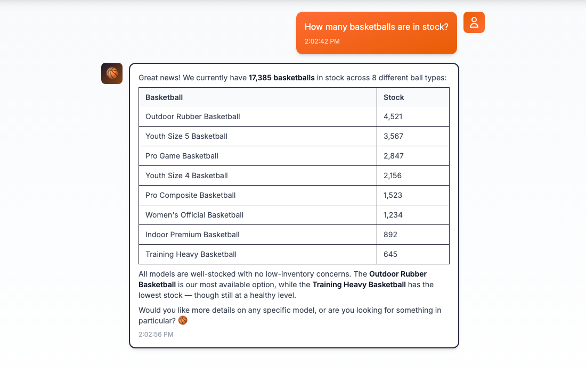
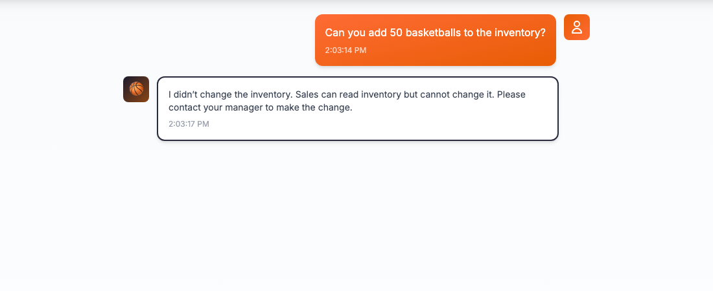
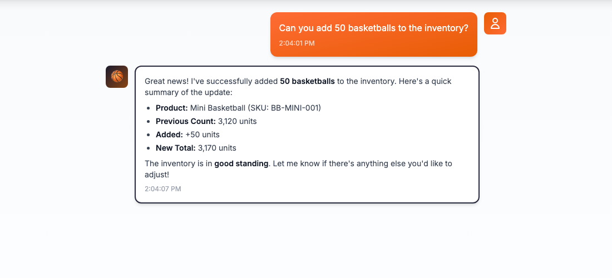
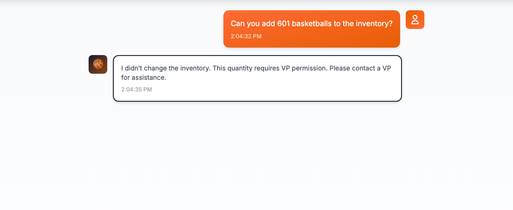
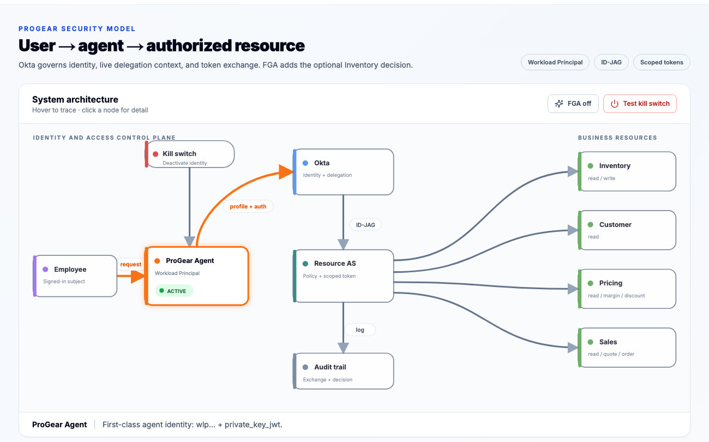
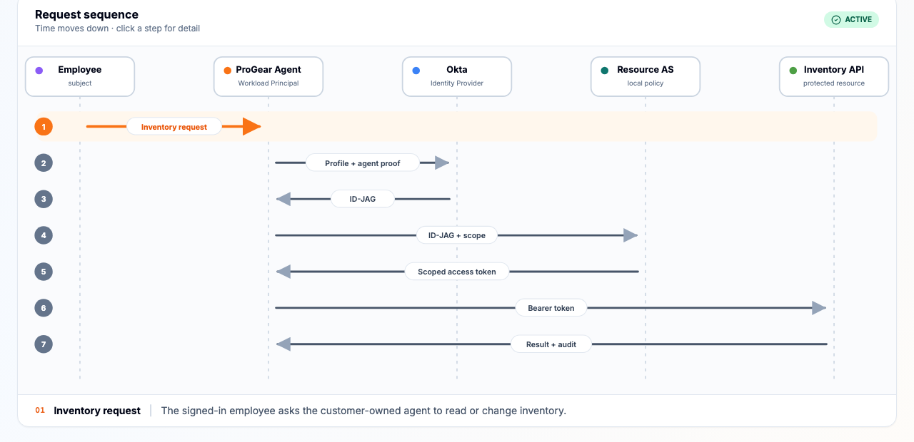
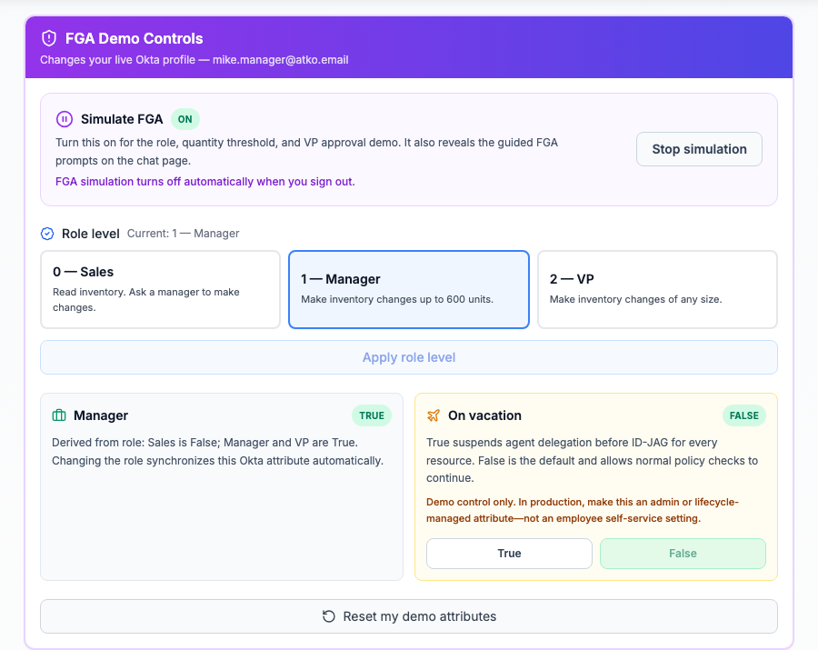
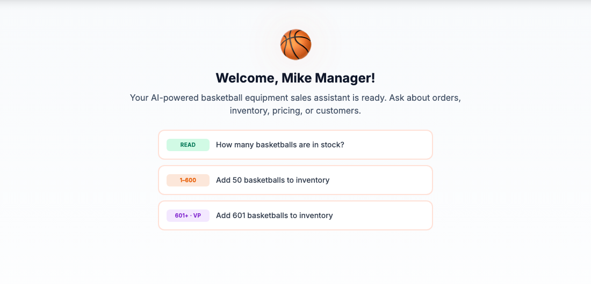
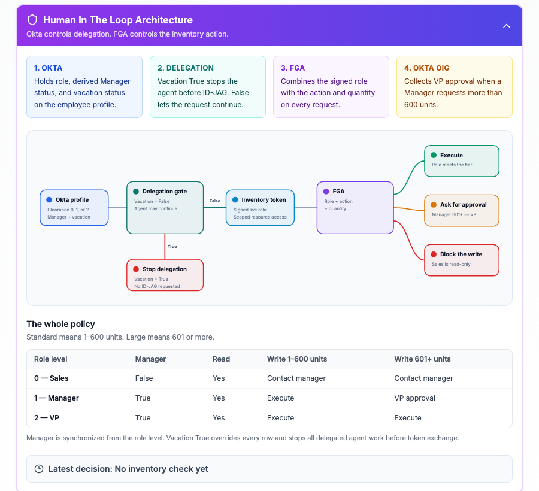
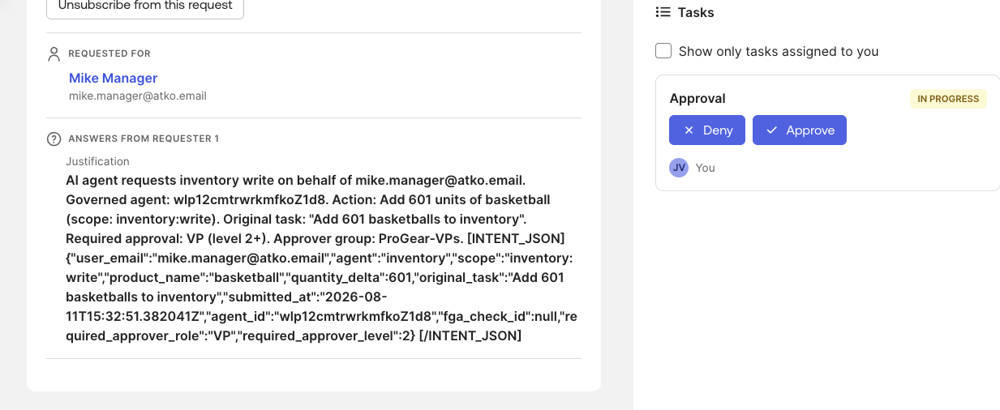

# CourtEdge ProGear — Customer Demo Guide

This is the editable source outline for the visual Word presenter guide.

- **Live demo:** https://progear-sales-aiagent.vercel.app
- **Recorded update:** https://drive.google.com/file/d/1N2XwGVgZXg2yHugp21hUTQoaBjaemxFw/view?usp=drive_link
- **Word guide:** `docs/CourtEdge-ProGear-Team-Demo-Guide.docx`

Keep demo credentials separate from this document and from recordings.

## The story

| Persona | Okta profile | Outcome |
|---|---|---|
| Sarah Sales | Clearance 0, Manager False | Reads Inventory. Every write is denied with manager guidance. |
| Mike Manager | Clearance 1, Manager True | Writes 1–600 units. A 601+ request requires a VP. |
| Joe VP | Clearance 2, Manager True | Approves Mike's 601+ request and may write directly. |

`On vacation` is a separate delegation control. When it is True, the agent stops before ID-JAG and cannot act for that employee.

## Core demo

1. Sign in as Sarah and select **How many basketballs are in stock?** The read succeeds.
2. Ask Sarah: **Can you add 50 basketballs to the inventory?** Inventory does not change; Sales must contact a Manager.
3. Sign out and sign in as Mike. FGA starts off again.
4. Ask Mike: **Can you add 50 basketballs to the inventory?** The normal write succeeds.
5. Ask Mike: **Can you add 601 basketballs to the inventory?** Simple mode stops at the VP boundary.
6. Open **Architecture** and explain the employee, governed Workload Principal, Okta, Resource AS, protected resource, audit chain, and agent kill switch.
7. Walk through **Request sequence** from employee request to ID-JAG, scoped resource token, protected resource, and auditable result.

### Sarah screenshots

**Presenter line:** Sarah is Sales, Clearance 0. Authentication proves who she is; it does not turn her identity into write authority.

### Mike screenshots

**Presenter line:** Mike is a Manager, Clearance 1. He can make routine changes up to 600 units. The optional FGA path routes 601+ to a VP.

## Architecture and request sequence

- The employee remains the subject.
- The ProGear Agent is a first-class Workload Principal with its own identity and lifecycle.
- Okta preserves both identities in the delegated chain.
- The Resource Authorization Server issues only a resource- and scope-specific token.
- The audit trail records who asked, which agent acted, and what was decided.
- Deactivating the agent identity stops new token exchanges.

1. The employee asks the agent to use Inventory.
2. The agent presents workload identity and employee context.
3. Okta issues an Identity Assertion Grant for the delegation.
4. The agent exchanges it for a scoped resource token.
5. The agent calls Inventory and the result remains auditable.

If delegation is stopped—such as `On vacation=True`—there is no ID-JAG and no scoped resource token.

## Optional FGA and VP approval

1. Sign in as Mike and open **FGA**.
2. Select **Simulate FGA**.
3. Confirm Manager, Clearance 1, and On vacation False.
4. Return to Chat and select **Add 601 basketballs to inventory**.
5. Copy the Okta request ID.
6. Sign in as Joe and open **Okta Access Requests → Inbox → Open**.
7. Approve Mike's request.
8. Return to ProGear and show the one-time execution.

| Request | Result |
|---|---|
| Sarah, any write | Deny and contact a Manager. Never create an approval request. |
| Mike, 1–600 units | Execute directly. |
| Mike, 601+ units | Create one VP approval request; do not change Inventory while pending. |
| Joe, any quantity | Execute directly because Joe is Clearance 2 / VP. |

## Reset

- Restore `On vacation=False`.
- Confirm Sarah is 0, Mike is 1, and Joe is 2.
- Confirm Manager is False for Sarah and True for Mike and Joe.
- Resolve test OIG requests that should not remain open.
- Sign out and confirm the next session starts with FGA simulation off.
